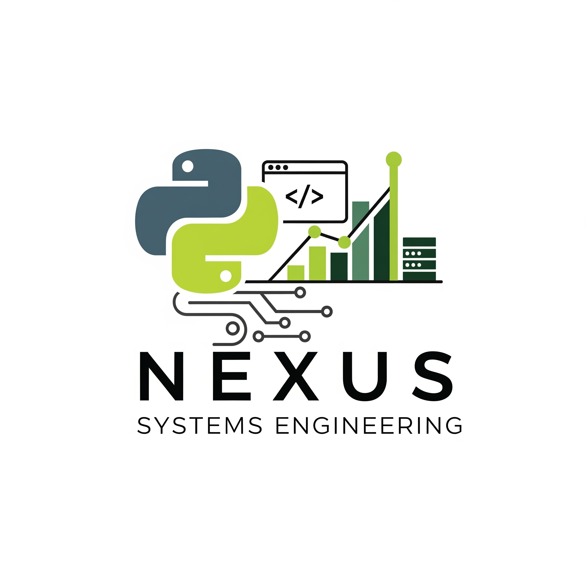

# 👋 Hola, mi nombre es Jesus David Peña

### Fullstack | Python | JavaScript | Sql | Backend

  

# 🫱🏼‍🫲🏼 Estoy aquí para ayudarte, si necesitas:

* Desarrollo de aplicaciones web backend con Python y frameworks como FastAPI, Django y Flask.
* Automatización de procesos y scripting para optimizar flujos de trabajo.
* Diseño y gestión de bases de datos relacionales y no relacionales.
* Integración de APIs y servicios de terceros.
* Análisis de datos para la toma de decisiones.

# 🛠️ Experiencia

## Como ingeniero de sistemas, me especializo en el diseño y la implementación de soluciones con un enfoque en la eficiencia y la escalabilidad. He trabajo en los sectores de:

* Farmacéutica
* Retail
* Hoteleria 

# 🚀 Proyectos 

Aquí puedes encontrar algunos de mis proyectos más recientes, la mayoria desarrollados en Python.

<ul style="color:#cccccc; font-family:monospace;">
  <li>
    <a href="URL_DEL_PROYECTO_1"> Análisis de datos con Numpy, Pandas, Matplotlib</a>
    - Breve descripción del proyecto.
  </li>
  <li>
    <a href="URL_DEL_PROYECTO_2"> Aplicación de escritorio con Tkinter y base de datos PostgresQL</a>
    - Breve descripción del proyecto.
  </li>
  <li>
    <a href="URL_DEL_PROYECTO_3"> Mapping Web Interactivo</a>
    - Breve descripción del proyecto.
  </li>
</ul>

 

# ✉️ Contacto

## Estoy disponible para colaboraciones y nuevos proyectos. ¡No dudes en contactarme!

  <a href="https://www.linkedin.com/in/jesusd191120/">
    LinkedIn
  </a>
  <a href="mailto:jp.david91@gmail.com">
    Email
  </a>

