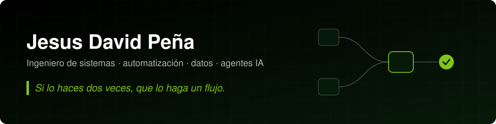

  

  
  

## 👋 Hola

Soy Jesus, ingeniero de sistemas. Me paso el día conectando cosas que no se hablaban entre sí: un WhatsApp con un CRM, un extracto bancario con una base de datos, un agente de IA con el resto del negocio.

La regla es simple: si una tarea se repite, se convierte en flujo. Si un flujo falla, se entera alguien antes que el cliente.

Hoy ese trabajo lo hago desde **Darlet Solutions**, mi consultora de automatización e IA. Este perfil es más personal: mi caja de herramientas y el respaldo de lo que voy aprendiendo.

## 🧰 Con lo que trabajo

**Orquestación y automatización**

**IA y agentes conversacionales**

**Datos**

**Código**

**Día a día**

## ⚙️ Cómo me gusta construir

- **Una sola fuente de verdad.** Postgres manda; las hojas de cálculo son espejo, nunca la verdad.
- **Leer antes de escribir.** Ningún cambio de datos sin saber qué hay y quién lo usa.
- **Lo simple primero.** Un flujo bien hecho le gana a diez microservicios que nadie mantiene.
- **Nada de credenciales en el frontend.** Ni "solo para probar".
- **Si falla, que avise.** Logs, reintentos y una alerta antes que una sorpresa.

## 🔭 En qué ando

- Agentes de IA sobre WhatsApp conectados a Kommo CRM.
- Pipelines de datos (ETL) con n8n → PostgreSQL para tener números de verdad, no intuiciones.
- Un sistema propio para seguir proyectos por fase, estado y "quién tiene la pelota".

## 🗂️ Sectores por los que he pasado

Farmacéutica · Retail · Hostelería

## ✉️ Contacto

  
  

Paleta: negro <code>#000000</code> · forest <code>#071908</code> · lima <code>#80C41C</code> · gris <code>#B3B3B3</code>. El historial de versiones de este perfil vive en los commits del repo.
